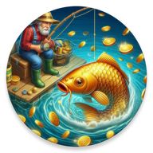
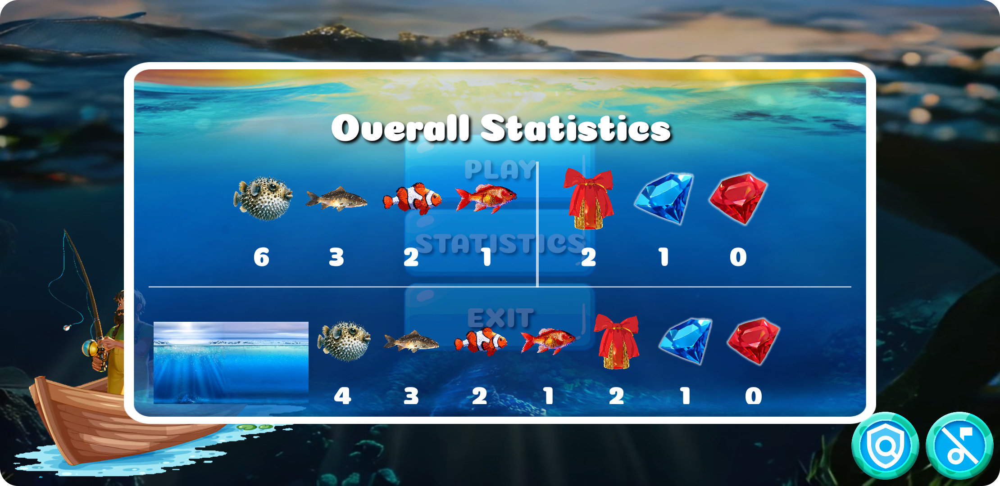
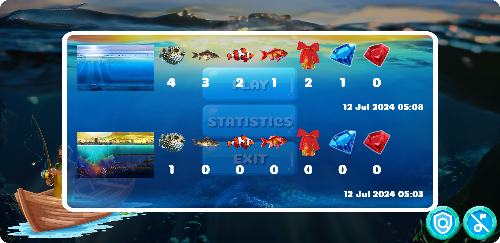
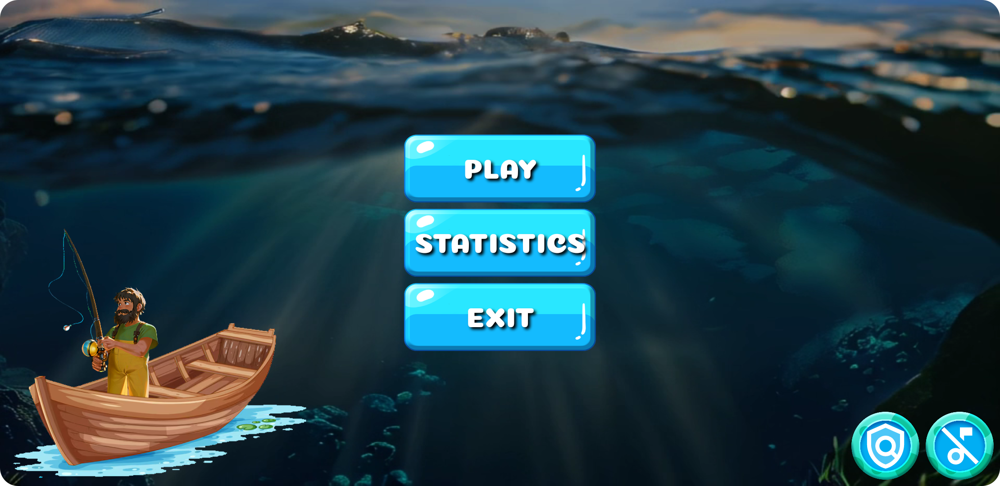
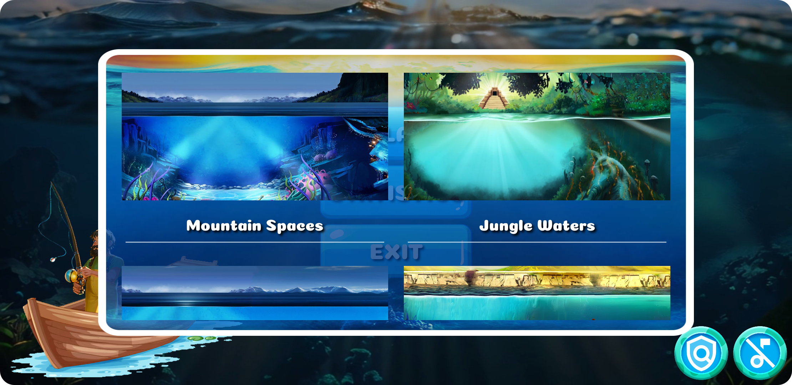

<p align="center"></p>
<h1 align="center">Adventure on Fishing</h1>

## Description
<b>EN:</b>

A custom made 2D arcade game. Developed using **Java Android SDK**.

**Big Bass Bonanza** casino style game. In this game you need to catch fish and earn different values.

For the [**OneSignal**](https://www.onesignal.com) service to work, you need to replace the contents of the [google-services.json](https://github.com/CoolOtaku/AdventureonFishing/blob/main/app/google-services.json) from your [**Firebase**](https://firebase.google.com) account.

You also need to change ***ONESIGNAL_APP_ID*** to yours from the [**OneSignal**](https://www.onesignal.com) service.
The use of this ***ONESIGNAL_APP_ID*** occurs in the following line:

```java
21    private static final String ONESIGNAL_APP_ID = "[YOU_ONESIGNAL_APP_ID]";
```

File link from [***ONESIGNAL_APP_ID***](https://github.com/CoolOtaku/AdventureonFishing/blob/main/app/src/main/java/com/srcgame/adventureonfishing/Main.java).

<b>UA:</b>

Аркадна 2D гра, створена на замовлення. Розроблена за допомогою **Java Android SDK**.

В стилі казино гри **Big Bass Bonanza**. У цій грі потрібно ловити рибу, та заробляти різні цінності.

Для роботи сервісу [**OneSignal**](https://www.onesignal.com) потрібно замінити вміст файлу [google-services.json](https://github.com/CoolOtaku/AdventureonFishing/blob/main/app/google-services.json) зі свого облікового запису [**Firebase**](https://firebase.google.com).

Також необхідно змінити ***ONESIGNAL_APP_ID*** на свій з сервісу [**OneSignal**](https://www.onesignal.com).
Використання цього ***ONESIGNAL_APP_ID*** зустрічається в такому рядку:

```java
21    private static final String ONESIGNAL_APP_ID = "[YOU_ONESIGNAL_APP_ID]";
```

Посилання на файл із [***ONESIGNAL_APP_ID***](https://github.com/CoolOtaku/AdventureonFishing/blob/main/app/src/main/java/com/srcgame/adventureonfishing/Main.java).

#
## Screenshots
<p align="center">
  
  
  
  
  
  
  
  
</p>

#
## Technologies used
<b>EN:</b>
- Creating a 2D game using the **Java Android SDK**
- Work on the **Android** platform
- Obfuscation **ProGuard**
- Using the [**OneSignal**](https://www.onesignal.com) service
- Use of third-party library [**Glide**](https://github.com/bumptech/glide) to manage images and **GIF**-animations
- Using [**RoomDatabase**](https://developer.android.com/training/data-storage/room) to store data
- Advanced game settings
- Game statistics
- Internal game currency
- Multi streaming
- Creating animations in **Adobe Photoshop**

<b>UA:</b>
- Створення 2D гри за допомогою **Java Android SDK**
- Робота на платформі **Android**
- Обфускація **ProGuard**
- Використання сервісу [**OneSignal**](https://www.onesignal.com)
- Використання сторонньої бібліотеки [**Glide**](https://github.com/bumptech/glide) для управління картинками та **GIF**-анімаціями
- Використання [**RoomDatabase**](https://developer.android.com/training/data-storage/room) для збереження даних
- Розширені налаштування гри
- Ігрова статистика
- Внутрішня ігрова валюта
- Багато потоковість
- Створення анімацій в **Adobe Photoshop**

#
## License
```
© 2024, CoolOtaku (ericspz531@gmail.com)
```
